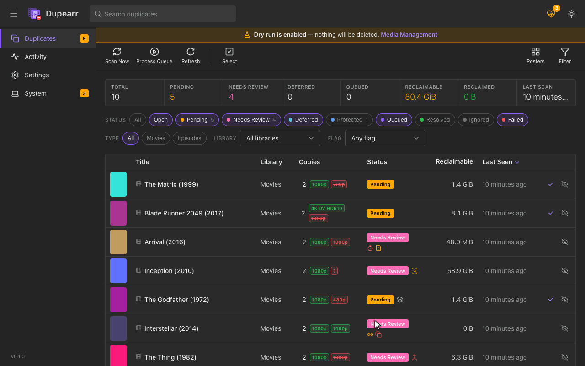
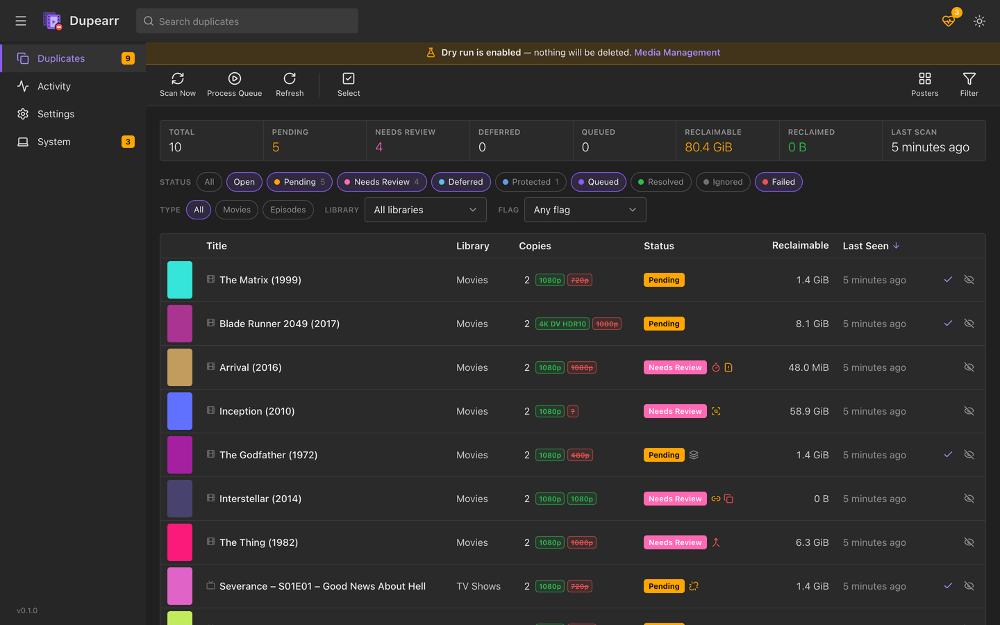
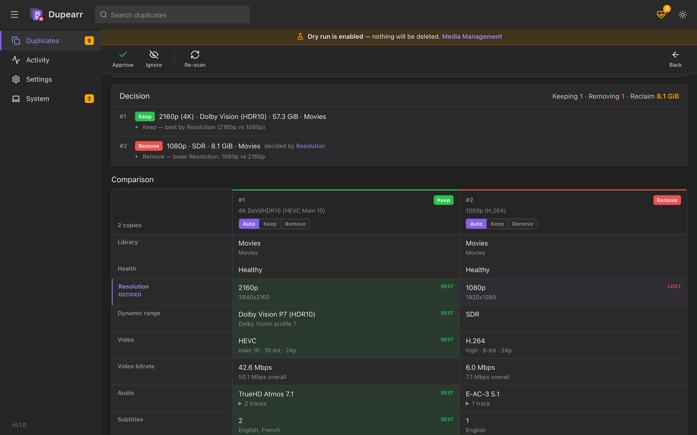
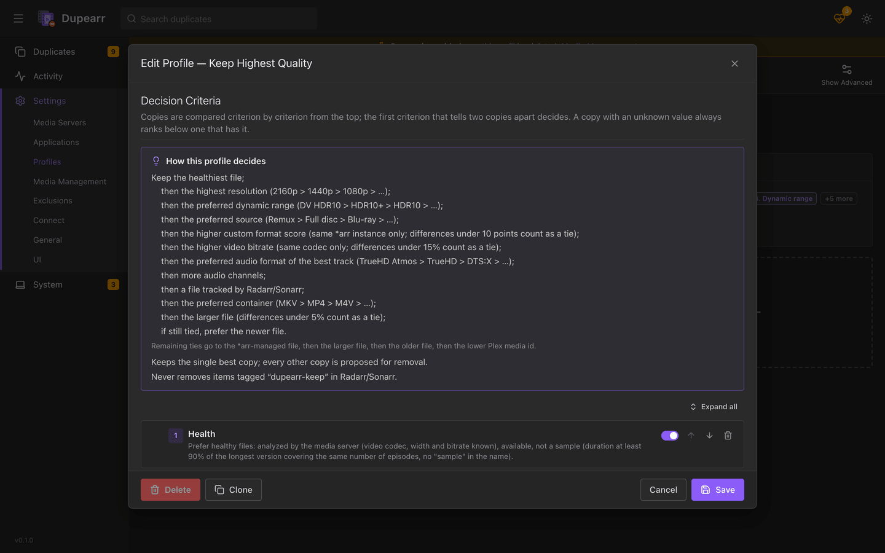
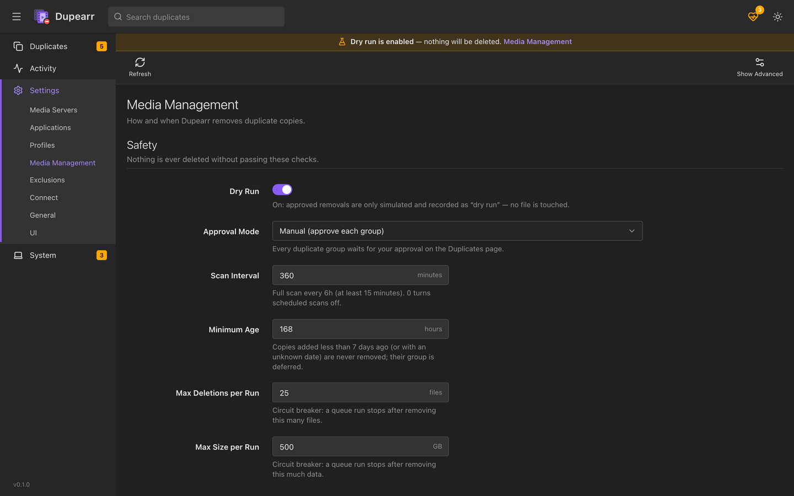
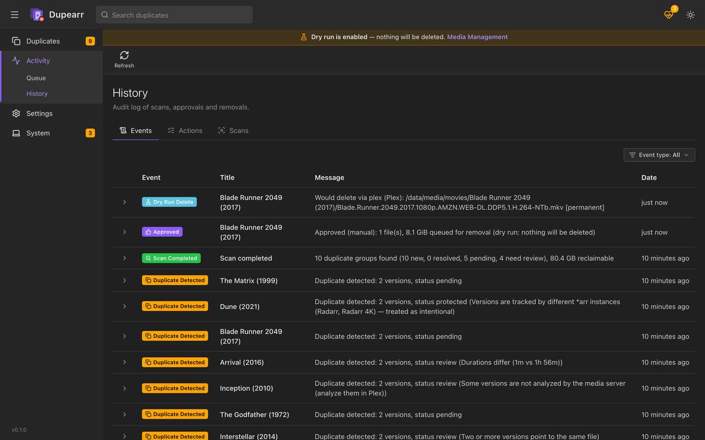
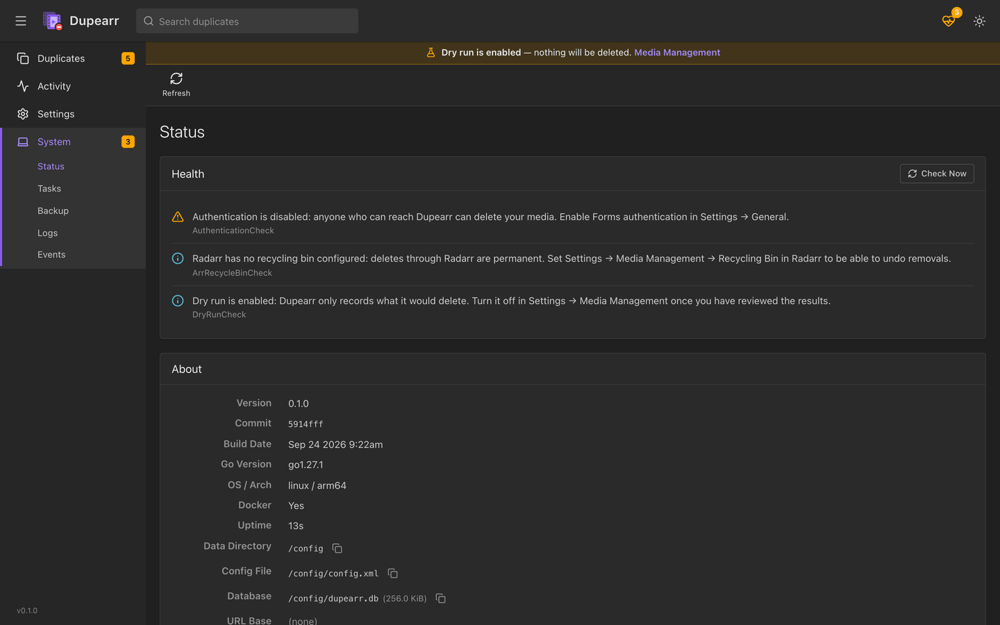
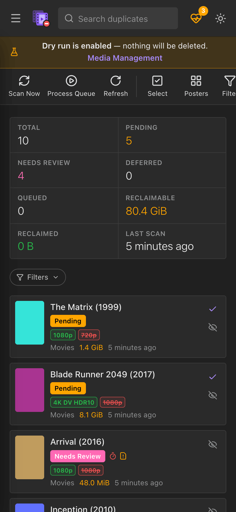

<p align="center">
  
</p>

<h1 align="center">Dupearr</h1>

<p align="center">
  <b>Keep the best copy of every movie and episode in Plex. Safely remove the rest.</b><br>
  A self-hosted, *arr-style duplicate manager for Plex, Radarr and Sonarr, with a web UI.
</p>

<p align="center">
  <a href="https://github.com/sl0wz3r/dupearr/actions/workflows/ci.yml"></a>
  <a href="https://github.com/sl0wz3r/dupearr/actions/workflows/release.yml"></a>
  <a href="https://github.com/sl0wz3r/dupearr/releases/latest"></a>
  <a href="https://github.com/sl0wz3r/dupearr/pkgs/container/dupearr"></a>
  <a href="LICENSE"></a>
</p>

> [!IMPORTANT]
> **Beta (0.1).** Dupearr deletes media files. It starts in its safest state: dry run and manual
> approval are on, recent files are never touched, and every run has a cap (see
> [Safety first](#safety-first)). It is still new software, so keep backups of anything you
> cannot replace, and read a few dry-run results before you let it remove anything.

---

Dupearr scans your Plex libraries for content you have more than once — two versions of the same
movie, the same episode in two files, a film in both "Movies" and "Movies 4K" — and enriches every
copy with what Radarr/Sonarr know about it (quality, custom-format score, release group, which
instance tracks it). Your **decision profile** ("keep the highest resolution, then HDR, then the
remux, …") picks the copy to keep, explains why, and lets you review everything before a single
file is touched. Approved removals go through the owning \*arr (so it doesn't re-download them),
through Plex, or into Dupearr's own recycle bin.

**Want to see it first?** The [demo](#try-it-without-touching-your-library) runs Dupearr against
a fake Plex, Radarr and Sonarr, so you can try everything without touching your library.

## Contents

- [Screenshots](#screenshots)
- [Features](#features)
- [Safety first](#safety-first)
- [Why Dupearr?](#why-dupearr)
- [Try it without touching your library](#try-it-without-touching-your-library)
- [Quick start](#quick-start) — [Unraid](#unraid) · [docker compose](#docker-compose) · [docker run](#docker-run) · [binaries](#native-binaries)
- [First run](#first-run)
- [Configuration reference](#configuration-reference)
- [How deletion works](#how-deletion-works)
- [FAQ](#faq)
- [Getting help](#getting-help)
- [Security](#security)
- [Known limitations & roadmap](#known-limitations--roadmap)
- [Contributing & development](#contributing--development)
- [License](#license)

User guides live in [`docs/user/`](docs/user/): [requirements](docs/user/requirements.md) ·
[Unraid](docs/user/installation-unraid.md) ·
[Docker](docs/user/installation-docker.md) · [native](docs/user/installation-native.md) ·
[configuration](docs/user/configuration.md) · [profiles](docs/user/profiles.md) ·
[safety](docs/user/safety.md) · [webhooks](docs/user/webhooks.md) ·
[dashboards](docs/user/dashboards.md) · [troubleshooting](docs/user/troubleshooting.md) ·
[FAQ](docs/user/faq.md).

## Screenshots

The screenshots show a fake library served by Dupearr's test servers (`tools/fakemedia`, the
same ones the [demo](#try-it-without-touching-your-library) uses). No real media was involved.

<p align="center">
  
</p>

<table>
  <tr>
    <td width="50%" valign="top">
      <a href="docs/images/duplicates.png"></a>
      <p align="center"><b>Duplicates</b>: every group, its status and the space you would reclaim</p>
    </td>
    <td width="50%" valign="top">
      <a href="docs/images/detail.png"></a>
      <p align="center"><b>Group detail</b>: the copies side by side, which one is kept and why</p>
    </td>
  </tr>
  <tr>
    <td width="50%" valign="top">
      <a href="docs/images/profile.png"></a>
      <p align="center"><b>Profiles</b>: an ordered chain of criteria that picks the keeper</p>
    </td>
    <td width="50%" valign="top">
      <a href="docs/images/settings.png"></a>
      <p align="center"><b>Settings</b>: the familiar *arr layout</p>
    </td>
  </tr>
  <tr>
    <td width="50%" valign="top">
      <a href="docs/images/history.png"></a>
      <p align="center"><b>Activity → History</b>: what was removed (or would have been, in dry run), how, and whether it can be restored</p>
    </td>
    <td width="50%" valign="top">
      <a href="docs/images/status.png"></a>
      <p align="center"><b>System → Status</b>: health checks that point at configuration problems</p>
    </td>
  </tr>
  <tr>
    <td colspan="2" align="center">
      <a href="docs/images/mobile.png"></a>
      <p align="center"><b>Mobile</b>: the same UI on a phone</p>
    </td>
  </tr>
</table>

## Features

- **Duplicate detection in Plex** — movies and episodes with several versions in one item (what
  Plex's own "Duplicates" filter shows) and, opt-in per library group, the same title across
  libraries (e.g. *Movies* + *Movies 4K*), matched by TMDB/IMDb/TVDB ids.
- **Knows what not to call a duplicate** — Plex *Optimized Versions* are never touched; different
  editions (Director's Cut, Extended, IMAX…), 3D releases and different-language copies are kept
  apart by default; multi-episode files are handled per episode; a 4K and a 1080p copy managed by
  two different \*arr instances (the TRaSH "separate 4K instance" setup) is treated as intentional.
- **Radarr & Sonarr aware** — any number of instances. Each file is matched to the instance that
  tracks it, with quality, source (remux/Blu-ray/WEB…), custom-format score and tags. Items still
  downloading are left alone. Tag an item `dupearr-keep` in the \*arr to protect it.
- **Decision profiles** — an ordered chain of criteria (resolution, HDR/Dolby Vision, source,
  custom-format score, video bitrate, audio format and channels, codec, container, size, age,
  language, library, filename patterns, …) with tolerances, "keep N", "keep the best per
  resolution", protections and templates (*Keep Highest Quality*, *Keep One Per Resolution*,
  *Save Space*, *Maximum Compatibility*, *Trust My \*arr*). Every decision is explained:
  "decided by: resolution 2160p > 1080p". Optional **play-history** criteria (*Played*, *Last
  played*, from Tautulli) keep the copy people actually watch; an unknown play history is a tie,
  never "not played".
- **Full-disc backups** — a Blu-ray/UHD `BDMV/` folder (hundreds of `.m2ts` files), a DVD
  `VIDEO_TS/`, an `.iso` or a "Disc 1"/"Disc 2" set next to a movie is **one** copy, found on disk
  (Plex's default scanners hide discs) and ranked by its main feature. Discs are kept by default;
  when you allow it, a disc you approve is moved to the recycle bin as a whole, never file by file.
  Details: [profiles](docs/user/profiles.md#full-disc-backups) ·
  [safety](docs/user/safety.md#full-disc-backups).
- **Review UI** — side-by-side comparison of every copy with the winner highlighted, per-file
  Keep/Remove overrides, approve / ignore / re-scan, bulk actions, filters, reclaimable space.
- **Safe removal** — dry run by default, approval queue, keeper re-verification right before each
  removal, minimum age, per-run caps, recycle bin with restore, full audit history.
- **\*arr-style app** — `/config` volume with `config.xml` + SQLite, API key, Forms login,
  `/api/v1`, System → Status / Tasks / Backup / Logs / Events, scheduled tasks, health checks,
  notifications (Discord, Slack, Telegram, Pushover, Gotify, ntfy, Apprise, webhook, email),
  inbound webhooks from Radarr, Sonarr and Plex for instant re-checks.
- **Runs anywhere** — multi-arch Docker image (amd64/arm64) with PUID/PGID/UMASK, an Unraid
  template, docker compose, a registry-free `docker load` archive for x86-64 servers
  (`make docker-save`), and single static binaries for Linux, macOS and Windows. Any x86-64 CPU
  works (no AVX needed): see the [requirements](docs/user/requirements.md).

## Safety first

Dupearr deletes media, so every default errs on the side of doing nothing:

| Guard | Default | What it does |
|---|---|---|
| Dry run | **on** | Approved removals are simulated and logged ("would delete via Radarr 4K: …"); nothing is changed until you switch it off. |
| Manual mode | **on** | Nothing is removed without you approving the group. Auto mode only approves groups whose decision has been identical for 2 consecutive full scans, and never groups flagged for review. |
| Minimum age | **7 days** | Files added in the last 168 hours are never removed (the \*arr may still be upgrading). |
| Caps per run | **25 files / 500 GB** | Processing stops at either limit; it also stops after 3 consecutive failures, or on a Radarr/Sonarr error that points at a missing mount. |
| Keeper verification | always | Right before removing anything, Dupearr re-reads Plex (and the disk when it can) to confirm the copy being kept really exists — a copy in a recycle bin never counts — and that nothing changed: same files, same servers, and no exclusion, protection or disabled library added since you approved. Stale data is never acted on. |
| Never zero copies | always | A group always keeps at least one copy; overrides that would remove every copy are rejected. |
| Review flags | always | Suspicious matches (different folder titles or years, big runtime difference, unanalyzed files, samples, the same file seen twice, oversized groups) go to **review** and are never auto-approved. |
| Currently playing | always | Copies being streamed are skipped and retried later. |
| Full-disc backups | **kept** | A Blu-ray/DVD backup is never removed file by file (every method refuses a file inside a disc). With *Allow Removing Full Discs* on, a disc you approve yourself is moved into the recycle bin as a whole; by default a Plex-playable copy is always kept next to it. |
| Recycle bins | recommended | \*arr deletions honour the \*arr's recycle bin; filesystem removals can go to Dupearr's recycle bin and be restored. Every action is marked **Permanent** or **Recycle bin**. |

Details: [docs/user/safety.md](docs/user/safety.md).

## Why Dupearr?

Plex can already show you duplicates, and several tools remove them. Dupearr's focus is the part
that is easy to get wrong: deciding which copy to keep, and removing the others in a way that you
can review and undo. The table compares what each tool documents (from its README and source), as
of 2026-09:

| | **Dupearr** | Plex's *Duplicates* view | [plex_dupefinder](https://github.com/l3uddz/plex_dupefinder) | [Cleanarr](https://github.com/se1exin/Cleanarr) | [Deduparr](https://github.com/deduparr-dev/deduparr) | [Deduplarr](https://github.com/thedinz/Deduplarr) |
|---|---|---|---|---|---|---|
| Interface | Web UI (\*arr-style) and API | Plex apps | Command line (Python) | Web UI | Web UI | Web UI |
| Finds duplicates | Versions within one Plex item; opt-in, the same TMDB/IMDb/TVDB id across libraries; full-disc backups found on disk | Items with two or more merged versions, intentional or not | Plex's duplicate filter | Plex's duplicate filter | The Plex API, plus an optional filesystem "deep scan" (MD5 and fuzzy title) | The Plex API |
| Picks the copy to keep | An ordered chain of criteria with tolerances; every decision is explained | You decide | An additive score (codecs, resolution, filename patterns, file size) | Keeps the widest version by default (ties: the largest) | An additive score plus regex rules | Your preferences for container, codecs and subtitles |
| Radarr/Sonarr | Any number of instances: quality, custom-format score and tags for every copy | — | — | — | Removes files through them, then rescans | — |
| Removes files through | The owning \*arr, Plex, or Dupearr's recycle bin (with restore) | Plex (owner account, *Allow media deletion*) | The Plex API | The Plex API | Radarr/Sonarr, qBittorrent, then the disk; rolls back on failure | The Plex API (versions or subtitle files) |
| Out of the box | Dry run, manual approval, 7-day minimum age, per-run caps | Manual | Interactive; automatic mode optional | Manual selection | Dry run | Manual or automatic mode |
| Project activity | New (2026-09) | Part of Plex | Last change 2024-02 | Last change 2024-07 | Active | New (2026-07) |

"—" means the tool does not document such a feature.

Other tools do things that Dupearr does not. Deduparr's filesystem scan can find copies that Plex
never matched, and it works with qBittorrent. Deduplarr can also remove subtitle files. Cleanarr
is widely used (about 738,000 Docker pulls). Plex's own view needs nothing extra. If you want
rule-based cleanup of watched or old media rather than duplicates, look at
[Maintainerr](https://github.com/Maintainerr/Maintainerr); Dupearr only deals with copies you
have more than once.

## Try it without touching your library

[`deploy/demo`](deploy/demo/) starts Dupearr next to a **fake** Plex, Radarr, Radarr 4K and Sonarr,
already configured and scanned. The fake library is a set of empty placeholder files in a Docker
volume, and it covers the interesting cases: a 4K remux next to a 1080p WEB-DL, Plex Optimized
Versions, a multi-episode file, two films Plex merged by mistake, editions and language variants
that are not duplicates, and a 4K + 1080p pair managed by two Radarr instances. Scan, review,
approve and even "delete": nothing real is involved, and no folder of your computer is mounted.
All you need is Docker with Compose v2:

```sh
mkdir dupearr-demo && cd dupearr-demo
curl -fsSLO https://raw.githubusercontent.com/sl0wz3r/dupearr/main/deploy/demo/docker-compose.yml && docker compose up -d
```

Then open <http://localhost:3873/> (no login; the demo only listens on 127.0.0.1). Is port 3873
taken, for example by your real Dupearr? Start it with `DEMO_PORT=3874 docker compose up -d` and
open port 3874 instead. `docker compose down -v` removes the demo completely. What to try:
[deploy/demo/README.md](deploy/demo/README.md).

Working on Dupearr itself? `make test-env` builds the same setup from source (see
[Contributing & development](#contributing--development)).

## Quick start

**Requirements:** a 64-bit Linux host, x86-64 (any CPU; no AVX needed) or arm64. You need Docker
Engine 20.10 or newer (25.0+ recommended), or Unraid 6.12.x or 7.x, and about 30 MB of RAM while
idle. Dupearr also needs to reach Plex and, optionally, Radarr (v5/v6) and Sonarr (v4). A native
static binary is also available (Linux kernel 3.2+, no glibc). Full checklist, with how to check
each item: [docs/user/requirements.md](docs/user/requirements.md).

The web UI and API listen on port **3873** ("DUPE" on a phone keypad). All data lives in one
directory (`/config` in Docker). Mount your media at **the same path your Plex and Radarr/Sonarr
containers use** (the TRaSH Guides `/data` layout) so all apps agree on file paths; otherwise
add path mappings in Dupearr (see [First run](#first-run), step 5).

The image is published on the GitHub Container Registry as `ghcr.io/sl0wz3r/dupearr` (tags `latest`,
`X.Y.Z` and `X.Y`; linux/amd64 and linux/arm64). Every release lists the image digest: pin a
version **and its digest** (`…/dupearr:0.2.0@sha256:<digest>`) to pull exactly the image that was
tested, and check where it was built with
`gh attestation verify oci://ghcr.io/sl0wz3r/dupearr:<version> --owner sl0wz3r`.

### Unraid

**Install via Community Applications** (recommended):

> The Community Applications listing is not live yet. Until Dupearr shows up in the **Apps** tab,
> use the manual template (*Without Community Applications*, below).

1. Open the **Apps** tab, search for **Dupearr** and click **Install**.
2. Check the paths (`/config` → `/mnt/user/appdata/dupearr`, `/data` → the same host folder your
   Plex and Radarr/Sonarr containers use, usually `/mnt/user/data`) and PUID 99 / PGID 100, then
   **Apply**.
3. Open the WebUI from the container's icon and follow [First run](#first-run). Dry run is on
   until you turn it off.

Unraid offers an update whenever a new release moves the `:latest` tag (Docker tab → *Check for
Updates*). Support: [issues](https://github.com/sl0wz3r/dupearr/issues).

Without Community Applications: copy [`unraid/dupearr.xml`](unraid/dupearr.xml) to
`/boot/config/plugins/dockerMan/templates-user/my-dupearr.xml`, then **Docker → Add Container →
Template: dupearr** (under *User templates*) and **Apply**.

Full guide: [unraid/README.md](unraid/README.md) and [docs/user/installation-unraid.md](docs/user/installation-unraid.md).

### docker compose

```sh
mkdir dupearr && cd dupearr
curl -fsSLO https://raw.githubusercontent.com/sl0wz3r/dupearr/main/deploy/docker-compose.yml
curl -fsSL -o .env https://raw.githubusercontent.com/sl0wz3r/dupearr/main/deploy/.env.example
$EDITOR .env        # PUID/PGID, TZ, DOCKERCONFDIR, DOCKERSTORAGEDIR
docker compose up -d
```

See [`deploy/docker-compose.yml`](deploy/docker-compose.yml) and [docs/user/installation-docker.md](docs/user/installation-docker.md).

### docker run

```sh
docker run -d --name dupearr \
  --restart unless-stopped \
  --stop-timeout 30 \
  --security-opt=no-new-privileges:true \
  --cap-drop=ALL --cap-add=CHOWN --cap-add=DAC_OVERRIDE --cap-add=KILL --cap-add=SETGID --cap-add=SETUID \
  -p 3873:3873 \
  -e PUID=1000 -e PGID=1000 -e UMASK=002 -e TZ=Europe/Amsterdam \
  -v /docker/appdata/dupearr:/config \
  -v /data:/data \
  ghcr.io/sl0wz3r/dupearr:latest
```

### Native binaries

Download the archive for your platform from the
[releases page](https://github.com/sl0wz3r/dupearr/releases)
(`dupearr_<version>_<os>_<arch>.tar.gz`, `.zip` on Windows, plus `checksums.txt`), unpack it and run:

```sh
./dupearr --data ~/.config/Dupearr     # --data is optional; this is the default on Linux
```

Then open <http://localhost:3873/>. A systemd unit following the Servarr conventions ships in the
Linux archives and in [`deploy/systemd/`](deploy/systemd/). Guide:
[docs/user/installation-native.md](docs/user/installation-native.md) (Linux, macOS, Windows,
Synology, TrueNAS).

## First run

Open `http://<host>:3873/`.

1. **Create your login.** On first start Dupearr asks you to set up authentication (Forms login
   with a username and a password of at least 8 characters; optionally not required for
   local-network clients). For safety this screen only works when you open Dupearr from your local
   network by IP address or local host name (`http://192.168.x.y:3873/`, `http://localhost:3873/`,
   `http://tower:3873/`), not through a public domain name, and it asks for the **setup code**
   Dupearr prints in its log at startup (`docker logs dupearr`, line *First-run setup is pending
   … setupCode=XXXXX-XXXXX-XXXXX-XXXXX*; a new code at every start).
2. **Add Plex** — *Settings → Media Servers → +*. Use **Sign in with Plex** to pick the server
   and connection, or enter the URL and token by hand. **Test** reports whether the token is the
   server **owner's** and whether **Allow media deletion** is on (both are only needed for the
   Plex deletion method).
3. **Enable libraries** — choose which movie and TV libraries to scan. Libraries that should be
   compared *with each other* (e.g. *Movies* and *Movies 4K*) get the same **scope group**; each
   library can use its own profile.
4. **Add Radarr / Sonarr** — *Settings → Applications → +*. URL (including any URL base) and the
   API key from the \*arr's *Settings → General*. Add every instance, including a separate 4K one.
5. **Path mappings** — *Settings → Media Management → Path Mappings*. Needed when Plex, the
   \*arrs and Dupearr see the same files under different paths (for example `/movies` in Plex,
   `/data/media/movies` in Radarr), **and** for the filesystem deletion method, Dupearr's recycle
   bin and hardlink detection, which only work inside folders covered by a Plex mapping. With the
   TRaSH `/data` layout everywhere, add one mapping for your Plex server that maps the folder to
   itself (remote `/data/media` → local `/data/media`); matching needs nothing else. Not using the
   filesystem method? Remove it from *Deletion Methods* instead. See
   [path mappings](docs/user/configuration.md#path-mappings).
6. **Review the profile** — *Settings → Profiles*. The default is *Keep Highest Quality*; start
   from a template or build your own chain.
7. **Scan** — *Duplicates → Scan Now*. Scans also run on a schedule (every 6 hours by default).
8. **Review** — open a group to compare the copies side by side, read why each one won or lost,
   override Keep/Remove per file, **Ignore** groups you want to keep as they are.
9. **Approve** — approved removals are queued and processed (*Activity → Queue*). With **dry run
   on (the default)** they are only simulated: check *Activity → History* for what *would* have
   happened. When you are happy, turn dry run off in *Settings → Media Management* and approve
   again.

Your API key is under *Settings → General* (shown after re-entering your password); use it for
scripts (`X-Api-Key` header). [Webhooks](docs/user/webhooks.md) use the separate webhook token.

## Configuration reference

Host settings live in `config.xml` in the data directory; everything else (profiles, connections,
safety settings) is stored in the database and edited in the UI.

### Data directory

| Path | Contents |
|---|---|
| `config.xml` | Host settings (below) |
| `dupearr.db` (+ `-wal`, `-shm`) | SQLite database |
| `logs/dupearr.txt` (+ rotations) | Log files (also under *System → Log Files*) |
| `Backups/{scheduled,manual,update}/` | Backup zips of `config.xml` + database |

Default location: `/config` in Docker; natively the per-user config directory
(`~/.config/Dupearr` on Linux, `~/Library/Application Support/Dupearr` on macOS,
`%AppData%\Dupearr` on Windows), or whatever `--data` says.

### `config.xml` and environment variables

Environment variables override `config.xml` without being written back to it; the UI shows such
fields as read-only. Names are `DUPEARR__SECTION__KEY` (double underscores). An empty value counts
as unset.

| `config.xml` element | Default | Environment variable | Notes |
|---|---|---|---|
| `BindAddress` | `*` | `DUPEARR__SERVER__BINDADDRESS` | `*` = all interfaces |
| `Port` | `3873` | `DUPEARR__SERVER__PORT` | HTTP port |
| `UrlBase` | *(empty)* | `DUPEARR__SERVER__URLBASE` | e.g. `/dupearr` behind a reverse proxy |
| `EnableSsl` | `False` | `DUPEARR__SERVER__ENABLESSL` | built-in HTTPS (a reverse proxy is usually simpler) |
| `SslPort` | `9873` | `DUPEARR__SERVER__SSLPORT` | |
| `SslCertPath` / `SslKeyPath` | *(empty)* | `DUPEARR__SERVER__SSLCERTPATH` / `…__SSLKEYPATH` | PEM certificate and key |
| `ApiKey` | generated | `DUPEARR__AUTH__APIKEY` | 32 hex characters |
| `AuthenticationMethod` | `Forms` | `DUPEARR__AUTH__METHOD` | `Forms`, `External` (reverse-proxy auth) or `None` (only trusted when Dupearr is opened by an IP address or local host name) |
| `AuthenticationRequired` | `Enabled` | `DUPEARR__AUTH__REQUIRED` | or `DisabledForLocalAddresses` |
| `TrustedProxies` | *(empty)* | `DUPEARR__AUTH__TRUSTEDPROXIES` | your reverse proxy's IP/CIDR (also *Settings → General*); its forwarding headers are believed and, with `External`, only requests it relays are trusted ([security guide](docs/SECURITY.md#deployment-hardening-guide)) |
| `AllowedHosts` | *(empty)* | `DUPEARR__AUTH__ALLOWEDHOSTS` | host names Dupearr is reached by (`dupearr.example.com`, `*.example.com`; also *Settings → General*) |
| `LogLevel` | `info` | `DUPEARR__LOG__LEVEL` | `trace`, `debug`, `info`, `warn`, `error` |
| `LogSizeLimit` | `1` | `DUPEARR__LOG__SIZELIMIT` | MB per log file |
| `InstanceName` | `Dupearr` | `DUPEARR__APP__INSTANCENAME` | shown in the UI and notifications |
| `LaunchBrowser` | `False` | — | open the UI on start (native only) |
| `Branch` | `main` | — | informational |

### Container variables and ports

| Variable | Image default | Unraid template | Purpose |
|---|---|---|---|
| `PUID` / `PGID` | `1000` / `1000` | `99` / `100` | User/group Dupearr runs as; must be allowed to delete your media |
| `UMASK` | `002` | `022` | Permissions of files Dupearr creates |
| `TZ` | `Etc/UTC` | set by Unraid | Time zone (IANA name) |
| `DUPEARR__AUTH__TRUSTEDPROXIES` / `…__ALLOWEDHOSTS` | *(empty)* | *Trusted proxies* / *Allowed hosts* (advanced) | Only behind a reverse proxy, see above; leave empty to set them in *Settings → General* instead |

| Port | Use |
|---|---|
| `3873/tcp` | Web UI, API (`/api/v1`), `/ping` health endpoint |
| `9873/tcp` | Optional built-in HTTPS (`EnableSsl`) |

Command line: `dupearr [--data DIR] [--nobrowser]`, `dupearr healthcheck`, `dupearr version`,
`dupearr reset-auth` (forgotten password or a lockout: resets to a fresh login setup, clears the
trusted proxies and allowed hosts unless environment variables keep External authentication, and
replaces the API key, the webhook token and the session signing key, signing every session out). More in
[docs/user/configuration.md](docs/user/configuration.md).

## How deletion works

When a group is approved, each copy marked *Remove* becomes a queued action. The queue is
processed right away and every 5 minutes; for each action Dupearr:

1. **Re-verifies** against live data: the copy to remove must still be exactly what was reviewed
   (same Plex media id, paths and sizes), and a copy being kept must still exist and be readable.
   Anything unexpected → the action is skipped and the group goes back to **review**.
2. **Picks the first allowed method** in your order (default `arr`, `plex`, `filesystem`):

   | Method | Used when | What happens | Undo |
   |---|---|---|---|
   | **\*arr** | Radarr/Sonarr tracks the copy | Deleted through the \*arr API, so the \*arr knows it is gone and does not re-download it. Afterwards Dupearr rescans the movie/series so the \*arr adopts the kept copy, or unmonitors it when the kept copy lives elsewhere. | **Restorable** only if the \*arr's *Recycling Bin* is set (Settings → Media Management in Radarr/Sonarr); otherwise **permanent**. Dupearr checks and labels it. |
   | **Plex** | Plex has *Allow media deletion* on and the token is the owner's | Plex deletes that version's file (subtitles and other sidecar files stay). Never used for a file shared by several episodes unless every one of them keeps another copy. | **Permanent**. A Windows/macOS Plex server may move it to the system trash, but Plex does not guarantee it (and Docker/Linux has none). |
   | **Filesystem** | A Plex path mapping covers the file and Dupearr can reach it (for example through the `/data` mount) | Moved into Dupearr's recycle bin (same filesystem: an instant rename) or, with no recycle bin configured, deleted. Only video files inside a library folder of the copy's own Plex server (mapped to a local folder) are ever touched, and the file is re-identified on disk right before the move. | **Restorable** from *Activity* while it is in the recycle bin (kept 7 days by default); **permanent** without a recycle bin. |

3. **Cleans up**: refreshes the Plex item, removes the stale Plex entry if the file is gone,
   records the result in *History*, sends notifications and marks the group **resolved** (or
   **failed**).

With **dry run** on, steps 1–2 run and are recorded as *dry run* results; nothing is changed.
Removing a hardlinked copy (e.g. a file still seeding in `/data/torrents`) frees no space; such
copies are flagged and count as 0 bytes reclaimable.

## FAQ

**Does Dupearr delete anything out of the box?**
No. Dry run is on and manual approval is required. Even after you turn dry run off, nothing is
removed until you approve a group (or enable auto mode, which still waits for two identical scans
and skips anything flagged for review).

**Why are both my 4K and 1080p copies kept?**
If a different Radarr/Sonarr instance manages each copy, Dupearr assumes you want both (the TRaSH
separate-4K-instance setup) and marks the group *protected*. You can change that in
*Settings → Media Management*, or use the *Keep One Per Resolution* template to keep one of each
on purpose.

**Why is a group in *review* instead of *pending*?**
Something looked off: folder titles or years differ, runtimes differ a lot (often a sample or a
truncated file), a file has not been analyzed by Plex, Plex reports a kept copy as unavailable, or
two entries may point at the same file. Open the group to see the reason; you can still approve it
manually (one at a time; bulk approval skips review groups).

**Will Radarr/Sonarr just download the removed copy again?**
Not when the removal goes through the \*arr (the default first method): the \*arr deletes its own
file and rescans. If the kept copy lives elsewhere (another instance or library), Dupearr unmonitors
the item in the instance that lost its copy (configurable), and can add an import-list exclusion.

**What about Plex editions, 3D and foreign-language copies?**
They are not duplicates by default: each edition, 3D release and language variant is grouped
separately. Each behaviour can be switched off in *Settings → Media Management*.

**Does it need Plex Pass?**
No. Plex Pass is only needed if you want Plex to send webhooks for instant re-checks.

**Does it need access to my media files?**
Only for the filesystem deletion method, Dupearr's recycle bin, and hardlink detection (plus a Plex
path mapping for the mounted folder). Deleting through Radarr/Sonarr or Plex works without mounting
media at all; then remove `filesystem` from the deletion methods so the health check does not warn
about missing mappings.

**Jellyfin / Emby / music?**
Not yet — see [Known limitations & roadmap](#known-limitations--roadmap).

**Can I use the API?**
Yes: `http://<host>:3873/api/v1/…` with the `X-Api-Key` header. See [docs/API.md](docs/API.md).

**I forgot my password.**
`docker exec -it dupearr dupearr reset-auth`, then restart the container (natively:
`dupearr reset-auth --data <dir>`). You will be asked to create a new login.

More answers in the [FAQ](docs/user/faq.md).

## Getting help

- **Questions and setup help:**
  [Discussions → Q&A](https://github.com/sl0wz3r/dupearr/discussions/categories/q-a).
- **Bugs:** open an issue with the
  [bug report form](https://github.com/sl0wz3r/dupearr/issues/new/choose). It asks for your
  version, install method, dry-run setting and logs. Never paste API keys or tokens, and check the
  file paths in your logs before you post them.
- **Something was removed that should not have been:** turn dry run back on, check *Activity →
  History* (anything in Dupearr's recycle bin can be restored), then report it.
- **Security vulnerabilities:** privately, as described in [SECURITY.md](SECURITY.md).

Where each kind of question goes, and what to include: [SUPPORT.md](SUPPORT.md).

## Security

Dupearr holds your Plex **owner** token and \*arr API keys and can delete media, so treat it like
an admin console:

- Keep **Forms** authentication (the default). Never port-forward Dupearr's port to the internet;
  publish it only through a reverse proxy (HTTPS, ideally its own host name) and set *Trusted
  Proxies* (*Settings → General*, or `DUPEARR__AUTH__TRUSTEDPROXIES`) to the proxy's address.
- Keep **dry run** on until the results look right, and use a recycle bin.
- Backups contain every secret — store them like passwords.

The [deployment hardening guide](docs/SECURITY.md#deployment-hardening-guide) covers
authentication modes, reverse-proxy headers, file permissions, network isolation and updates. The
full security review is in [docs/SECURITY.md](docs/SECURITY.md); report vulnerabilities privately
as described in [SECURITY.md](SECURITY.md).

## Known limitations & roadmap

What Dupearr does **not** do yet. Nothing here is a promise or a date; these are the directions
the design leaves room for. [ROADMAP.md](ROADMAP.md) has the details: what each item needs, where
it plugs in, and where help is welcome.

| Area | Today | Roadmap |
|---|---|---|
| Media servers | **Plex only.** Duplicates are what Plex has matched: two versions of one item, or (opt-in) the same TMDB/IMDb/TVDB id in libraries of one scope group. | **Jellyfin / Emby** support behind the same media-server layer. |
| Music, books | Only Plex *movie* and *show* libraries are scanned, with **Radarr** and **Sonarr**; music and photo libraries are ignored. | **Lidarr** and music libraries (albums/tracks need their own grouping rules). |
| Several Plex servers | Each server is scanned and grouped on its own; the same title on two servers is **not** a duplicate. With two or more enabled servers, removals **are** checked against the other servers: a file another server's item lists is only removed while that item keeps a file proven to be a different one, a file another server's group keeps goes to review, a server that could not be read is never taken as "does not list it", a Radarr/Sonarr whose paths are mapped is never matched by raw path to a server without path mappings, and with neither side mapped raw paths are only matched for the Plex servers you confirmed the instance feeds ([Safety](docs/user/safety.md#several-plex-servers)). This fails closed: an unmapped second server, or an Unraid user share, keeps the files it also lists protected. A disabled server is not protected. | Cross-server groups ("keep one copy across all my servers"), after live checks of file identities on the mounts people use ([research](docs/research/multi-server.md)). |
| Files Plex does not know | No content hashing: a copy Plex has not matched (wrong match, unscanned folder, a file outside every library) is invisible, and identical files are only detected through Plex and the \*arrs (same path/name + size, hardlinks). | Optional **hash-based** detection of identical files on disk, outside Plex. |
| Full-disc backups | Found only in a movie's own folder (or, in a shared folder, as an image named after the movie), read from the disc's metadata on every scan. Disc images (`.iso`) have unknown quality and go to review; discs in TV libraries and AVCHD/BDAV/HD DVD folders are only protected, never removed. | Reading the video attributes inside disc images; season discs in TV libraries. |
| Decision criteria | File attributes (resolution, HDR, source, custom-format score, bitrate, audio, codec, size, age, language, library, patterns…) and, with **Tautulli**, play history per Plex item (*Played*, *Last played*; versions of one item tie). | Plex as a play-history source, per-version attribution, a resume-progress criterion and per-user filters. |
| Dashboards | `GET /api/v1/duplicate/stats` returns the numbers (group counts, reclaimable and reclaimed space, last scan; API key required), but there is no ready-made widget. | A Homepage `customapi` example, and native **Homepage / Homarr** widgets. |
| Languages | The web UI is in English only. | Translations (i18n). |
| Shared host names | A URL base (`/dupearr`) behind a reverse proxy that serves other apps on the **same host name** (`/radarr`, `/sonarr`, …) is not an isolation boundary: they share one browser origin, so a script flaw (XSS) in any of them can act with your Dupearr session (it cannot read the API key, which the web UI never receives). | Give Dupearr its **own host name** (`dupearr.example.com`) — recommended whenever other apps share the proxy. |

Ideas are welcome in
[Discussions → Ideas](https://github.com/sl0wz3r/dupearr/discussions/categories/ideas); pull
requests are welcome too, see [Contributing & development](#contributing--development).

## Contributing & development

Contributions are welcome, from bug reports and docs fixes to code. Start with
[CONTRIBUTING.md](CONTRIBUTING.md): Dupearr deletes people's media, so it explains the safety rules
every change has to follow. Issues labelled
[good first issue](https://github.com/sl0wz3r/dupearr/labels/good%20first%20issue) are small and
well-scoped, and [help wanted](https://github.com/sl0wz3r/dupearr/labels/help%20wanted) marks
larger ones where a contributor would be welcome; please comment on an issue before you start.
[ROADMAP.md](ROADMAP.md) lists the bigger directions.

Requirements: Go 1.27+, Node.js 24 (20.19+ or 22.13+ also work), make; Docker with buildx for
images.

```sh
make            # web UI (web/dist) + binary (bin/dupearr)
make run        # build and run with a throwaway data dir (./tmp/data) on :3873
make test       # Go tests with the race detector
make e2e        # end-to-end tests: the real binary against fake Plex/Radarr/Sonarr
make lint       # go vet + gofmt check
make release    # cross-compiled archives + checksums in dist/ (run `make web` first)
make docker     # container image for this machine (dupearr:<version>)
make docker-test  # image + container tests (entrypoint, PUID/PGID, /config ownership, signals)
make docker-test-amd64  # the same tests on a linux/amd64 image (emulated on arm64 machines)
make docker-save  # linux/amd64 image as a `docker load` archive + .sha256 in dist/ (unraid/README.md)
make docker-push  # linux/amd64 + linux/arm64 to REGISTRY (`make help` shows it)
make help       # all targets and variables
```

Web UI work: run the backend (`make run`), then `cd web && npm run dev` — Vite serves the UI on
<http://localhost:5173> and proxies API calls to `:3873` (override with
`DUPEARR_URL=http://host:port`). Web checks: `npm run typecheck`, `npm test`, `npm run build`.

**Fake media servers.** `go run ./tools/fakemedia` serves a realistic fake Plex server plus
Radarr and Sonarr instances backed by sparse dummy files (TRaSH `/data` layout), so you can scan,
review and "delete" without touching real media. The same fakes back the end-to-end tests
(`internal/testutil/fakemedia`) and record any call Dupearr must never make. `make test-env`
starts Dupearr built from source next to the fakes in Docker, pre-configured with dry run on
([deploy/test-env](deploy/test-env/README.md)).

Design documents: [architecture](docs/ARCHITECTURE.md), [decisions](docs/DECISIONS.md) (these win
on conflict), [package contracts](docs/CONTRACTS.md), [HTTP API](docs/API.md) and the research notes
in [`docs/research/`](docs/research/). Contributions: [CONTRIBUTING.md](CONTRIBUTING.md). Changes:
[CHANGELOG.md](CHANGELOG.md).

## License

Dupearr is free software: you can redistribute it and/or modify it under the terms of the
[GNU General Public License](LICENSE) as published by the Free Software Foundation, either version 3
of the License, or (at your option) any later version — the same license family as Sonarr and
Radarr. It is distributed in the hope that it will be useful, but **without any warranty**. Dupearr
is not affiliated with Plex, Radarr or Sonarr.
